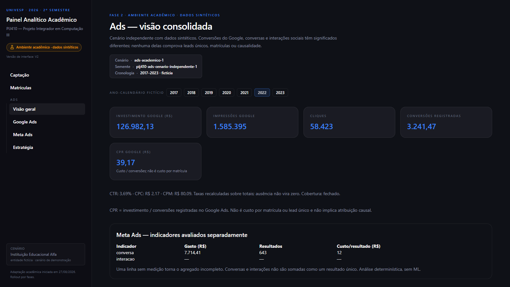
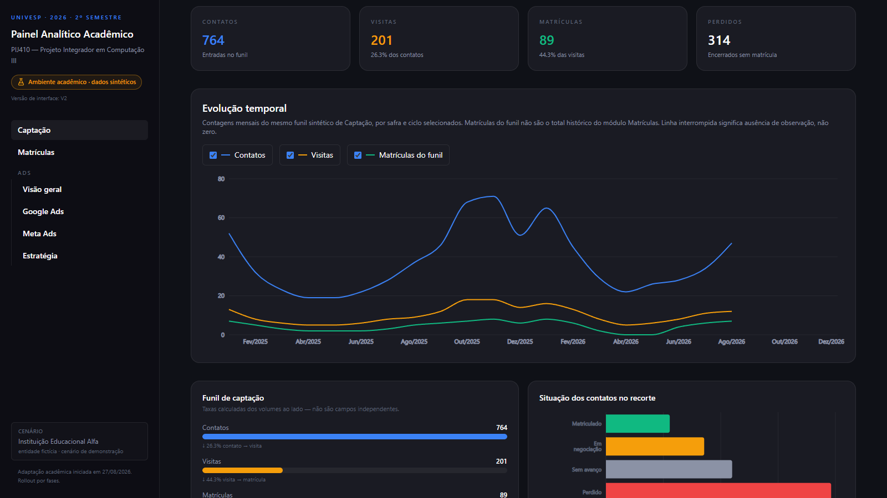

# Relatório Final — Projeto Integrador em Computação III (PIJ410)

<!--
CONTROLE EDITORIAL — não integrar ao DOCX/PDF de entrega.

| Seção do Parcial | Destino no Final | Classificação | Ação |
|---|---|---|---|
| Guia editorial, histórico V2/V3 e checklist de montagem | Não migrar | NÃO MIGRAR | Excluir marcações comparativas, URLs operacionais e instruções internas. |
| Dados do projeto | Capa, folha de rosto e ficha catalográfica | REVISAR | Confirmar título definitivo, cursos, nomes, Registro Acadêmico pendente, cidade, polo e dados do tutor. |
| 1 Introdução | 1 Introdução | REVISAR | Preservar o texto vigente e atualizar somente afirmações que dependam do estado final do projeto. |
| 2.1 Objetivos | 2.1 Objetivos | REVISAR | Preservar objetivos; ao final, conferir sua correspondência com os resultados efetivamente obtidos. |
| 2.2 Justificativa e delimitação do problema | 2.2 Justificativa e delimitação do problema | REUTILIZAR | Manter problema, relevância, escopo e limites já consolidados. |
| 2.3 Fundamentação teórica | 2.3 Fundamentação teórica | REUTILIZAR | Manter texto e citações vigentes; não acrescentar bibliografia nesta estrutura inicial. |
| Conteúdos de disciplinas citados na Introdução | 2.4 Aplicação das disciplinas estudadas no Projeto Integrador | NOVO NO FINAL | Organizar a relação entre mais de três disciplinas, materiais específicos e partes da solução. |
| 2.4 Metodologia | 2.5 Metodologia | EXPANDIR | Renumerar, preservar o método e completar implementar/testar, validação, feedback e ajustes. |
| 2.5 Resultados preliminares | 3 Resultados: solução final | EXPANDIR | Manter apenas resultados comprovados e abrir espaços explícitos para resultados finais. |
| Contato inicial com a comunidade | 3.1 Contato inicial e necessidades identificadas | REUTILIZAR | Preservar o registro já consolidado, sem tratá-lo como validação final. |
| Estratégia incremental e protótipo acadêmico | 3.2 e 3.3 | REVISAR | Atualizar o estado das fases antes de cada versão numerada do Final. |
| Captação e Matrículas | 3.4 Resultados técnicos | EXPANDIR | Manter o resultado funcional da Fase 1 e acrescentar apenas módulos realmente concluídos. |
| Aplicação/validação pendente | 3.5 a 3.8 | NOVO NO FINAL | Registrar aplicação, devolutivas, comparação antes/depois e ajustes somente após sua realização. |
| Limitações já declaradas | 3.9 Limitações | EXPANDIR | Consolidar dados sintéticos, ausência de integração, atribuição, períodos e generalização. |
| Figuras do Parcial | Capítulo 3 e listas pré-textuais | REVISAR | Reaproveitar somente imagens ainda fiéis e incluir novas evidências finais depois. |
| Referências | Referências | REUTILIZAR | Migrar as obras efetivamente citadas e conferir correspondência citação–referência. |
| Considerações finais | 4 Considerações finais | NOVO NO FINAL | Estruturar retomada de objetivos, resultados, comunidade, limitações e continuidade. |
| TCLE, instrumentos e evidências | Anexos e Apêndices | NOVO NO FINAL | Inserir TCLE no artefato final e organizar instrumentos sem expor dados pessoais no Markdown. |
-->

> Fonte editorial do Relatório Final, conforme ADR-001. Este arquivo admite apenas os marcadores
> `[PENDENTE – ...]`, `[REVISAR – ...]` e `[INSERIR FIGURA – ...]`. Planejamento não constitui
> resultado. O Relatório Parcial permanece preservado em `docs/relatorio/parcial.md`.

# ELEMENTOS PRÉ-TEXTUAIS

## Capa

**UNIVERSIDADE VIRTUAL DO ESTADO DE SÃO PAULO**

[PENDENTE – inserir os nomes dos integrantes conforme o registro acadêmico vigente, sem acrescentar outros identificadores pessoais]

**Plataforma Analítica para Apoio à Tomada de Decisão em Investimentos de Mídia Digital no Contexto Educacional**

[REVISAR – confirmar o título definitivo do trabalho]

**Vídeo de apresentação do Projeto Integrador**

[PENDENTE – inserir o link válido do vídeo publicado no YouTube]

[PENDENTE – confirmar cidade e polo que constarão na capa]

2026

## Folha de rosto

**UNIVERSIDADE VIRTUAL DO ESTADO DE SÃO PAULO**

**Plataforma Analítica para Apoio à Tomada de Decisão em Investimentos de Mídia Digital no Contexto Educacional**

[REVISAR – confirmar o título definitivo do trabalho]

Relatório Técnico-Científico apresentado na disciplina de Projeto Integrador para os cursos de
[PENDENTE – confirmar a forma oficial de registrar Bacharelado em Ciência de Dados e Engenharia da Computação]
da Universidade Virtual do Estado de São Paulo (UNIVESP).

[PENDENTE – confirmar cidade e polo]

2026

## Ficha catalográfica

[PENDENTE – preencher a ficha conforme o modelo oficial: autoria; título definitivo; total de folhas; natureza do trabalho; curso ou cursos; Universidade Virtual do Estado de São Paulo; tutor; polo; ano]

[REVISAR – confirmar o Registro Acadêmico ainda pendente antes da montagem do artefato final]

## Resumo

[PENDENTE – redigir, em parágrafo único e com até 250 palavras, a introdução, os objetivos, a metodologia, os resultados efetivamente obtidos e as considerações finais]

**Palavras-chave:** [PENDENTE – definir cinco palavras-chave, separadas por ponto e vírgula].

## Lista de ilustrações

[PENDENTE – gerar após a seleção, a numeração e a paginação definitivas das figuras]

## Lista de tabelas

[PENDENTE – gerar após a seleção, a numeração e a paginação definitivas das tabelas]

## Sumário

[PENDENTE – atualizar automaticamente no DOCX após a paginação final]

1 Introdução

2 Desenvolvimento

2.1 Objetivos

2.2 Justificativa e delimitação do problema

2.3 Fundamentação teórica

2.4 Aplicação das disciplinas estudadas no Projeto Integrador

2.5 Metodologia

3 Resultados: solução final

4 Considerações finais

Referências

Anexos

Apêndices

# 1 INTRODUÇÃO

O marketing digital articula canais, pontos de contato e interações que precisam ser examinados
em conjunto ao longo da relação entre a organização e seus públicos (Kannan; Li, 2017). Quando
campanhas são veiculadas em plataformas de anúncios, essas interações produzem registros de
investimento, alcance, cliques e conversões. A aplicação de métodos de ciência de dados permite
organizar tais registros e relacionar métricas de desempenho às decisões de marketing (Saura,
2021). No contexto educacional, painéis de indicadores podem apoiar gestores na compreensão de
informações oriundas de diferentes sistemas e nos processos de tomada de decisão (Lemes; Dias;
Oliveira, 2023).

Em campanhas digitais, métricas como investimento, conversão e retorno precisam ser interpretadas
em relação aos objetivos organizacionais e às configurações de cada ação (Saura; Palos-Sánchez;
Suárez, 2017). Na publicidade de busca, a possibilidade de combinar palavras-chave, lances,
dispositivos e períodos torna insuficiente uma leitura baseada em um único total (Martins, 2019).
Na instituição parceira, os registros de investimento e desempenho permanecem dispersos entre
fontes distintas, com indicadores, unidades de medida e recortes temporais próprios (Grupo do
Projeto Integrador, 2026). Essa fragmentação dificulta a comparação dos resultados entre canais e
campanhas, a avaliação do retorno obtido e a decisão sobre como distribuir o orçamento de marketing
(Grupo do Projeto Integrador, 2026). O problema que este trabalho enfrenta é, portanto, de natureza
analítica antes de ser tecnológica: os dados existem, mas não se apresentam em forma que sustente
a decisão.

A ideia básica que orienta o trabalho é que esse conjunto disperso pode ser consolidado e submetido
à análise de dados em escala. Indicadores calculados por regras determinísticas poderão ser
complementados pela investigação experimental de padrões. Neste trabalho, foi executado um
experimento separado de regressão para CPR no Google Ads, com dados integralmente sintéticos,
com resultados da CLI exibidos no módulo Google Ads da Fase 2 acadêmica, sem treinamento
no navegador. A interface web apresenta os resultados
disponíveis de modo acompanhável pela gestão. O objeto deste trabalho é, assim, o desenvolvimento
acadêmico de uma solução analítica para investimentos em mídia digital no contexto educacional.
A avaliação comunitária registrada limitou-se a Captação, Matrículas e ao ajuste de visualização
temporal, sem avaliar decisões de orçamento ou os módulos de Ads e ML.

A escolha do tema decorre de uma necessidade real, manifestada por uma instituição de ensino
privada da região metropolitana de São Paulo à qual o grupo teve acesso por intermédio de um de
seus integrantes. Em conversa inicial, a gestora de marketing da instituição expôs a dificuldade
de estabelecer quanto deveria ser investido em tráfego pago e de avaliar se os valores praticados
eram adequados aos objetivos institucionais. Em contato posterior com a direção, buscou-se
identificar quais indicadores seriam mais relevantes para acompanhar os investimentos realizados e
seus resultados ao longo do tempo. A receptividade da equipe e o acesso direto aos profissionais
envolvidos indicaram condições para desenvolver a solução e submetê-la à validação da comunidade
participante, sem antecipar o resultado dessa validação.

Soma-se a essa demanda a composição interdisciplinar do grupo, que reúne estudantes dos cursos de
Bacharelado em Ciência de Dados e Engenharia da Computação. Aplicações em Aprendizado de Máquina,
Redes Neurais e Aprendizado Profundo fornecem repertório de algoritmos, frameworks e modelos
neurais pertinente à análise e à interpretação dos dados do projeto (UNIVESP, 2020). Visão
Computacional amplia o repertório de aquisição, processamento e análise de dados visuais, enquanto
Impactos da Computação na Sociedade orienta a reflexão sobre os aspectos éticos, sociais, legais e
de governança de dados relacionados ao uso de inteligência artificial (UNIVESP, 2020; UNIVESP,
2026). Esses conteúdos são mobilizados como base de formação; o projeto não prevê o uso de imagens
nem de dados sensíveis da instituição parceira.

# 2 DESENVOLVIMENTO

## 2.1 Objetivos

O projeto busca desenvolver análise de dados em escala a partir de um conjunto de dados históricos
de investimentos em mídia digital, aplicando métodos analíticos e preparando uma interface para
visualização dos resultados. A aprendizagem de máquina foi delimitada a um experimento sintético
de CPR no Google Ads, executado separadamente do protótipo. Essa finalidade corresponde ao tema norteador da UNIVESP e
articula o problema identificado junto à comunidade parceira (Grupo do Projeto Integrador, 2026).

### 2.1.1 Objetivo geral

Desenvolver uma solução analítica para organizar dados históricos de investimentos em mídia digital
e apoiar a tomada de decisão sobre a distribuição do orçamento de marketing em uma instituição de
ensino.

### 2.1.2 Objetivos específicos

- Consolidar dados históricos de investimento e desempenho de campanhas provenientes de fontes distintas em uma estrutura adequada à análise.
- Identificar e organizar indicadores que permitam comparar o desempenho de canais e campanhas.
- Implementar rotinas determinísticas para calcular indicadores a partir dos dados consolidados, com parâmetros e resultados passíveis de conferência.
- Avaliar, em dados históricos integralmente sintéticos de Google Ads, uma regressão supervisionada para estimar CPR, comparando-a à persistência do CPR histórico elegível e registrando métricas, controles de leakage e limitações.
- Empregar IA agêntica via linha de comando como apoio controlado à formulação, execução e interpretação de cenários de simulação, sem substituir os cálculos determinísticos, o modelo de aprendizagem de máquina ou a revisão humana.
- Desenvolver uma interface web que apresente os indicadores de forma compreensível para a gestão.
- Avaliar a versão do protótipo com profissionais da instituição parceira, registrando as contribuições recebidas para sua evolução.

No estado documentado, a organização de dados, os indicadores, os cálculos determinísticos e a
interface foram implementados no ambiente acadêmico com dados sintéticos; o experimento de CPR
foi executado e comparado às referências definidas. A avaliação da interface foi parcial:
uma profissional examinou Captação, Matrículas e o ajuste temporal, não Ads ou ML. Não há
execução documentada de cenários de simulação com IA agêntica via CLI; o uso assistivo de IA
na programação e documentação, descrito em 2.5.12, não demonstra esse objetivo específico.

## 2.2 Justificativa e delimitação do problema

O problema de pesquisa foi identificado nas conversas iniciais com a gestora de marketing e a
direção da instituição parceira. Os dados de investimento e desempenho das campanhas de mídia
digital permanecem distribuídos em fontes distintas, o que dificulta comparar canais, avaliar o
retorno das campanhas e decidir sobre a distribuição do orçamento de marketing (Grupo do Projeto
Integrador, 2026). Diante desse contexto, a pesquisa é orientada pela seguinte questão: como
organizar e apresentar os dados históricos de investimentos em mídia digital de modo a apoiar a
tomada de decisão da gestão de uma instituição de ensino?

O problema vincula-se ao tema norteador da UNIVESP porque parte de um conjunto de dados existente,
demanda análise de dados em escala e prevê uma interface web para tornar os resultados
acompanháveis. A aprendizagem de máquina integra o tema por meio do experimento sintético de
CPR no Google Ads, sem inferência operacional ou decisão autônoma. A escolha de indicadores e métricas é necessária para
avaliar a efetividade das estratégias de marketing digital e verificar sua aderência aos objetivos
organizacionais (Saura; Palos-Sánchez; Suárez, 2017). A proposta, portanto, não se limita à criação
de uma interface: busca converter dados dispersos em informação que possa sustentar uma decisão de
gestão.

A relevância acadêmica decorre da aproximação entre ciência de dados, marketing digital e apoio à
decisão. A literatura aponta que a ciência de dados pode extrair informações acionáveis de grandes
conjuntos de dados nesse contexto, embora ainda existam lacunas sobre sua gestão e aplicação em
estratégias de marketing (Saura, 2021). A relevância social e cultural está em desenvolver a
solução a partir das necessidades expressas pelos profissionais da comunidade participante,
preservando seu contexto de trabalho e submetendo o protótipo à sua avaliação (Grupo do Projeto
Integrador, 2026). Busca-se, assim, contribuir para que a gestão acompanhe informações relevantes às
suas decisões sem impor um modelo desvinculado da realidade institucional.

O escopo está limitado à consolidação, à análise e à visualização de dados históricos relacionados
a campanhas de mídia e aos indicadores definidos com a instituição parceira. Não fazem parte do
estudo a integração com contas reais de anúncios, gestão de relacionamento com clientes (CRM),
sistemas acadêmicos ou outras bases operacionais, nem o tratamento de dados pessoais ou
informações comerciais sensíveis. O ambiente acadêmico independente e sanitizado utiliza somente
dados sintéticos locais. As Fases 1 e 2 estão funcionais localmente: Captação, Matrículas e Ads
(visão geral, Google Ads, Meta Ads e Estratégia). Conteúdo orgânico e Objetivo da Gestão com
Arquitetura e Algoritmos, das Fases 3 e 4, permanecem planejados e bloqueados. A
camada de IA agêntica poderá receber apenas contexto fictício ou
sanitizado e será acionada pelo grupo. Resultados de simulações deverão ser identificados como
exploratórios e dependerão de cálculo determinístico e revisão humana.

## 2.3 Fundamentação teórica

A fundamentação adota três camadas distintas. A primeira é a análise determinística, formada por
métricas e indicadores obtidos por regras explícitas. A segunda é a aprendizagem de máquina,
entendida como treinamento e avaliação de modelos que aprendem padrões a partir de exemplos
históricos e produzem estimativas para novas observações (Jordan; Mitchell, 2015). A terceira é a
IA agêntica ou generativa, utilizada somente como apoio controlado à organização e à interpretação,
sem ser apresentada como o método que aprende com os dados.

Essa distinção é particularmente necessária no marketing digital: a revisão de De Mauro, Sestino e
Bacconi (2022) posiciona a aprendizagem de máquina como subárea da IA e identifica aplicações em
marketing ligadas a apoio à decisão e impacto financeiro. Assim, a contribuição técnica prevista
não é apenas uma interface nem uma explicação gerada por IA. O recorte de aprendizagem de máquina
adotado é uma regressão supervisionada para CPR no Google Ads, com dados sintéticos. O modelo,
a variável-alvo, as entradas, o particionamento e as métricas do experimento executado são
documentados nas subseções 2.5.11 e 3.4.4.

### 2.3.1 Marketing digital e decisão orientada por dados

O marketing digital pode ser compreendido como um conjunto integrado de atividades, canais e
interações mediadas por tecnologias digitais, e não como a simples publicação de anúncios. Nessa
perspectiva, a organização define objetivos, seleciona pontos de contato com seus públicos,
acompanha as respostas obtidas e ajusta suas ações à luz dos resultados. Kannan e Li (2017)
destacam a necessidade de examinar o marketing digital de forma integrada, considerando os
diferentes canais e as jornadas que conectam a organização aos seus públicos.

Para uma instituição de ensino, esse enquadramento aproxima os dados de mídia de uma decisão
gerencial concreta: avaliar como os recursos de comunicação contribuem para os objetivos de
captação definidos pela organização. Isso não autoriza concluir, sem evidência, que uma campanha
causou uma matrícula. A análise pode organizar os registros históricos disponíveis, identificar
padrões de desempenho e apresentar evidências comparáveis sobre canais, campanhas, públicos e
períodos, sempre dentro dos limites dos dados recebidos.

O uso de dados no marketing digital transforma registros operacionais, como investimento,
exposição, interações e conversões registradas, em insumos para acompanhamento e decisão. Saura
(2021) associa a aplicação de ciência de dados no marketing digital à análise de desempenho e à
utilização de métricas para orientar ações. No escopo deste projeto, a interface web é o meio de
visualização dos resultados; a contribuição central é a organização analítica dos dados e, em
experimento separado, a avaliação de aprendizagem de máquina sobre o CPR sintético do Google Ads.
Não há aprendizagem de máquina em Captação, Matrículas, Meta Ads, conteúdo orgânico ou gestão;
esses módulos utilizam ou preveem análise determinística e descritiva.

Assim, a decisão orientada por dados é tratada como processo de apoio, e não como substituição do
julgamento dos responsáveis da instituição. Os indicadores e as estimativas analíticas devem
oferecer evidências para priorizar investigações e discutir a distribuição do orçamento, enquanto
as decisões finais permanecem condicionadas ao contexto institucional, às metas de captação e às
restrições identificadas pela comunidade externa.

### 2.3.2 Tráfego pago e campanhas de anúncios

Tráfego pago, no escopo deste trabalho, corresponde às ações de comunicação em que a instituição
investe recursos para veicular anúncios em plataformas digitais e direcionar usuários a um ponto de
contato definido. A expressão não se confunde com todo o marketing digital: ela delimita a parcela
das ações cuja veiculação produz registros de investimento e desempenho. O recorte demonstrativo
desta etapa utiliza exclusivamente dados sintéticos, sem importação de registros operacionais
da instituição parceira.

As campanhas de anúncios oferecem diferentes possibilidades de configuração. No caso da
publicidade de busca, por exemplo, é possível associar anúncios a palavras-chave e ajustar lances
segundo fatores como dispositivo e período de veiculação (Martins, 2019). Essa variedade torna
inadequada uma leitura que considere somente o total investido ou o total de cliques. A análise
deverá observar as unidades efetivamente presentes na base, como canal, campanha, grupo de
anúncios, anúncio, palavra-chave ou período, sem presumir que todos esses campos estarão
disponíveis.

O propósito da análise não é declarar antecipadamente qual campanha deve receber mais orçamento.
Busca-se organizar evidências para comparar exposição, interesse, conversão e custo em relação aos
objetivos de captação definidos com a instituição. Em publicidade de busca paga, as decisões de
lance e de orçamento são influenciadas pelo modo como as conversões são atribuídas aos elementos
que antecedem a ação do usuário (Li et al., 2016). Por isso, a regra de atribuição registrada pela
plataforma, quando disponível, deve ser tratada como parte do contexto analítico.

### 2.3.3 Indicadores e tomada de decisão

Os indicadores são calculados por regras determinísticas e usados em conjunto, evitando decisões
baseadas em uma métrica isolada. Investimento, impressões e alcance descrevem a exposição; cliques e
taxa de cliques (CTR) avaliam a resposta inicial; custo por clique (CPC) mostra o custo do tráfego;
conversões e taxa de conversão aproximam o resultado de captação; custo por aquisição (CPA) e
retorno sobre o investimento em publicidade (ROAS) apoiam a comparação entre o valor gerado e o
recurso aplicado (Saura, 2021; Saura; Palos-Sánchez; Suárez, 2017).

| Indicador ou combinação | Pergunta de decisão que orienta |
|---|---|
| Investimento, impressões e alcance | Onde houve entrega e exposição suficientes para justificar continuidade ou revisão da segmentação? |
| Cliques, CTR e CPC | Quais anúncios, públicos ou palavras-chave atraem interesse com custo compatível? |
| Conversões, taxa de conversão e CPA | Quais campanhas transformam interesse em ação desejada a um custo sustentável? |
| Receita ou valor atribuído, investimento e ROAS | Como priorizar a distribuição do orçamento entre campanhas e canais? |

Fonte: Elaborado pelo grupo (2026).

A atribuição de conversões deve ser declarada antes das comparações, pois a regra escolhida altera o
crédito atribuído aos elementos da jornada e pode modificar decisões de lance, orçamento e retorno
estimado (Li et al., 2016). Quando não houver receita ou valor de conversão confiável na base, o
relatório não calculará ROAS como se fosse dado observado; usará os indicadores disponíveis e
registrará a limitação.

### 2.3.4 Análise de dados em escala e apoio à tomada de decisão

A análise de dados em escala começa pela organização de registros históricos. O objetivo não é
acumular dados, mas estabelecer um processo reprodutível para receber, identificar, padronizar,
integrar e transformar os registros em uma base adequada à análise. Essa preparação evita que
comparações entre campanhas e períodos sejam afetadas por nomes inconsistentes, formatos
incompatíveis, valores ausentes, duplicações ou unidades de medida diferentes.

A qualidade desse processo é parte do resultado analítico. Foidl et al. (2024) identificam
ingestão, integração, limpeza e transformação como etapas relevantes de pipelines de dados e
associam problemas de qualidade a aspectos como tipos de dados, compatibilidade e rastreabilidade.
Cada transformação relevante deverá ser documentada, de modo que um indicador ou uma estimativa
possa ser relacionado à sua origem, ao período analisado e às regras aplicadas.

A reprodutibilidade exige que outro integrante consiga reconstruir o resultado a partir das mesmas
entradas e condições de processamento (Peng, 2011). Por isso, o histórico de transformações, as
fórmulas e os parâmetros compõem a evidência do resultado. Achados agregados não são convertidos
automaticamente em relações de causa e efeito; funcionam como evidências para interpretação
conjunta com a instituição e como base para as rotinas de indicadores.

### 2.3.5 Aprendizagem de máquina aplicada ao marketing digital

A aprendizagem de máquina é tratada como método analítico distinto do cálculo de indicadores.
Enquanto CTR, CPC, taxa de conversão e CPA resultam de fórmulas previamente definidas, um modelo de
aprendizagem de máquina é treinado com exemplos históricos para reconhecer padrões e produzir uma
estimativa para observações não usadas no treinamento. Jordan e Mitchell (2015) caracterizam esse
campo pela melhoria do desempenho em uma tarefa a partir da experiência representada pelos dados.

No contexto do marketing, De Mauro, Sestino e Bacconi (2022) situam a aprendizagem de máquina como
subárea da inteligência artificial e identificam aplicações ligadas ao apoio à decisão e ao impacto
financeiro. Neste PI, o recorte experimental é uma regressão para CPR no Google Ads, com
variáveis históricas elegíveis e calendário em cenário inteiramente sintético. O desenho
exclui informação contemporânea que reconstruiria a fórmula do target ou não estaria disponível
na emissão da estimativa; não propõe previsão de matrículas ou recomendação de orçamento.

O método exige a descrição das variáveis de entrada, da variável-alvo, do particionamento entre
treinamento e teste, dos modelos comparados e das métricas de avaliação. A qualidade de um modelo
não pode ser inferida apenas por produzir uma previsão aparentemente plausível: deve ser avaliada
em dados separados e confrontada com uma referência simples e reprodutível.

### 2.3.6 Visualização de dados e dashboards para apoio à gestão educacional

A visualização de dados é a camada pela qual os resultados analíticos se tornam acessíveis aos
profissionais que participam da decisão. Um dashboard deve apresentar indicadores, comparações e
recortes temporais de forma que o usuário compreenda o que está sendo medido e formule perguntas
sobre o desempenho das campanhas. Em instituições de ensino, Lemes, Dias e Oliveira (2023)
identificam o uso de dashboards como recurso de apoio à tomada de decisão e à integração de
informações provenientes de sistemas distintos.

Padrões de design de dashboards ajudam a relacionar estrutura, interação e conteúdo, permitindo
justificar por que determinada visão emprega comparação temporal, detalhamento, agrupamento ou
destaque de exceções (Bach et al., 2023). O protótipo seleciona os recursos visuais por sua função
na interpretação. A interface deve preservar contexto: período, canal, unidade de análise, fórmula
do indicador e limitações dos dados precisam permanecer disponíveis.

A avaliação com a comunidade externa deve verificar se as visualizações permitem compreender os
resultados e discutir as decisões previstas. As sugestões recebidas serão registradas como
evidências de adequação e melhoria do protótipo, sem afirmar que o dashboard, por si só, garante
melhoria nas decisões ou nos resultados de captação.

### 2.3.7 Uso controlado de IA agêntica e supervisão humana

A IA agêntica é tratada como recurso auxiliar de organização e interação com ferramentas, e não
como sinônimo de aprendizagem de máquina aplicada à base de campanhas. Agentes baseados em modelos
de linguagem podem combinar componentes como planejamento, memória e uso de ferramentas; contudo,
a área permanece em desenvolvimento e apresenta desafios de avaliação e confiabilidade (Wang et
al., 2024). Essa característica impede que suas respostas sejam aceitas como evidência sem
verificação.

Modelos de linguagem de alta capacidade poderão atuar como camada de interpretação assistida:
organizar evidências, comparar cenários e formular explicações preliminares sobre indicadores e
resultados já calculados. O agente não terá acesso a contas reais de anúncios, não executará
alterações de orçamento e não definirá o modelo de aprendizagem de máquina sem validação do grupo.
Dados sensíveis ou identificáveis não serão enviados a essa camada.

Para garantir rastreabilidade, a engenharia de memória e contexto reunirá somente documentos
versionados, dados locais sanitizados, fórmulas de indicadores, resultados do modelo e decisões já
registradas. Toda explicação ou recomendação deverá indicar a evidência que a sustenta e será
rejeitada quando criar métricas, resultados ou conclusões sem base verificável. A decisão final
permanece sob responsabilidade humana, em diálogo com a instituição parceira.

## 2.4 Aplicação das disciplinas estudadas no Projeto Integrador

No desenvolvimento do projeto foram mobilizados conhecimentos relacionados a disciplinas
identificadas nos projetos pedagógicos da UNIVESP (2020; 2026). O grupo reúne integrantes de
diferentes cursos do eixo de TI, cujas contribuições podem mobilizar conhecimentos de disciplinas
e matrizes curriculares distintas. As relações abaixo descrevem
conceitos observáveis na implementação. Elas não comprovam quais disciplinas foram cursadas
pelos integrantes ou quais materiais didáticos foram consultados.

Os conhecimentos relacionados a Aplicações em Aprendizado de Máquina foram mobilizados na
formulação e avaliação de uma tarefa supervisionada de regressão. No protótipo, isso se
materializou nos experimentos de CPR sintético do Google Ads: regressão linear, comparação com
baselines, separação temporal de treinamento e teste, MAE, RMSE, R² e prevenção de vazamento
de informação. A previsão é experimental, sem eficácia operacional comprovada ou superioridade
geral do modelo. Não foram implementadas redes neurais ou aprendizado profundo.

Conhecimentos relacionados a Desenvolvimento Web e Engenharia de Software aparecem na interface
em Next.js e TypeScript, na componentização, na separação entre cálculo e apresentação, no
versionamento e nos testes automatizados. A liberação incremental por feature gates e as rotinas
reproduzíveis constituem evidências dessas práticas. A associação curricular é sustentada pelo
escopo das disciplinas e pela implementação, sem registro da origem didática dos conhecimentos.
Thakkar (2020) é referência bibliográfica externa sobre React e renderização no servidor; sua
citação não comprova consulta a material de uma disciplina.

A avaliação da interface e o ajuste da visualização temporal após o feedback de P1 também
evidenciam práticas relacionadas a Interface Humano-Computador. Essa relação é sustentada pelos
registros de validação V1 e reavaliação V2 e pela implementação da visualização consolidada,
sem comprovar qual aula ou material didático foi consultado.

Conhecimentos relacionados a Introdução a Ciência de Dados, Estatística e Probabilidade e
Visualização Computacional aparecem na preparação e agregação de dados sintéticos, no tratamento
de ausências, na descrição de séries mensais e na apresentação de indicadores e gráficos. As
métricas de erro e a comparação dos baselines sustentam uma avaliação limitada ao experimento,
sem inferência sobre a população da instituição ou causalidade. Estatística e Probabilidade é o
nome registrado no PPC de 2020; sua identificação na trajetória de ao menos um integrante cuja
contribuição esteja relacionada a essas práticas requer confirmação, sem pressupor uma matriz
curricular única para o grupo.

A relação com Impactos da Computação na Sociedade é observável nas decisões de utilizar dados
sintéticos, excluir informações pessoais e integrações operacionais e manter supervisão humana.
O PPC de 2026 confirma o escopo curricular dessa associação, mas não comprova que a disciplina
foi efetivamente estudada por ao menos um integrante que contribuiu com essas práticas. Em
Projeto Integrador em Computação III, a orientação oficial
fundamenta a organização metodológica em ouvir, criar e implementar. Design Thinking é tratado
como abordagem metodológica do PI, também apoiada em Rosado e Dias (2024). Etapas planejadas não
são apresentadas como realizadas.

[PENDENTE – H07: para cada disciplina citada, confirmar que foi efetivamente estudada por ao menos um integrante cuja contribuição correspondente esteja relacionada ao projeto. Não se exige graduação ou matriz curricular única do grupo; curso e matriz individuais podem esclarecer o nome oficial quando necessário. Aula, apostila ou semana específica somente será incluída se houver comprovação de consulta; sua ausência, isoladamente, não impede descrever a aplicação dos conhecimentos.]

## 2.5 Metodologia

O percurso metodológico combina uma etapa quantitativa, voltada à preparação e à análise dos
registros, com uma etapa qualitativa, destinada a compreender as necessidades dos profissionais e
avaliar a utilidade e a compreensão do protótipo. As duas etapas permanecem articuladas: os dados
delimitam o que pode ser calculado ou estimado, enquanto a participação da comunidade indica quais
perguntas de gestão e formas de apresentação são relevantes. A descrição distingue a baseline
técnica construída dos procedimentos ainda planejados; atividades não realizadas não são
apresentadas como resultados.

### 2.5.1 Delineamento aplicado e Design Thinking

O projeto possui caráter aplicado: parte de uma demanda apresentada pela instituição parceira e
busca produzir uma solução analítica passível de discussão no contexto em que o problema foi
identificado. O percurso combina levantamento de necessidades, análise de dados, construção de
visualizações e validação progressiva com os profissionais que participam das decisões de
marketing. Essa aproximação é compatível com o uso de Design Thinking em pesquisas que articulam
compreensão do problema, ideação e experimentação de soluções (Rosado; Dias, 2024).

A sequência metodológica é composta por escuta inicial, definição do problema, identificação de
requisitos, prototipação, testes, validação e ajustes. Cada passagem deverá deixar evidências:
registro da necessidade, decisão de projeto, versão do protótipo, tarefa de teste, contribuição
recebida e ajuste correspondente.

### 2.5.2 Ouvir e interpretar o contexto

Na etapa de ouvir, foram consolidados os registros das entrevistas/conversas iniciais com
profissionais da instituição parceira, apoiadas pelo questionário estruturado preservado em
`docs/questionario_comunidade_externa.md`. A escuta identificou a necessidade de compreender
quanto investir em tráfego pago, avaliar a adequação dos valores investidos, acompanhar
indicadores, comparar informações ao longo do tempo e organizar dados dispersos. O relato mantém
a instituição e os participantes anonimizados e não incorpora dados pessoais ou informações
comerciais sensíveis.

As entrevistas iniciais foram realizadas mediante TCLE. O documento de consentimento será tratado
na composição final dos anexos, fora do repositório público e sem divulgar dados pessoais. Esse
consentimento refere-se ao levantamento inicial e não se confunde com o TCLE registrado para a
avaliação posterior de P1.

### 2.5.3 Definir o problema e os requisitos

As necessidades iniciais foram convertidas no problema de organizar e apresentar dados históricos
de investimentos em mídia digital para apoiar a tomada de decisão. A definição orientou requisitos
de indicadores, comparações, filtros, visualizações e rastreabilidade. A análise não deve confundir
associação agregada com causalidade, nem apresentar dado ausente como zero ou estimativa silenciosa.

### 2.5.4 Criar e prototipar

Na etapa de criar, as necessidades foram relacionadas aos campos disponíveis, às regras de cálculo
e às alternativas de visualização. A baseline foi construída em Next.js e TypeScript, separando os
dados sintéticos locais da camada de apresentação web. A construção segue estratégia incremental:
Fase 1, Captação e Matrículas; Fase 2, Ads; Fase 3, conteúdo orgânico; Fase 4, Objetivo da Gestão e
Arquitetura e Algoritmos. As Fases 1 e 2 constituem resultado funcional acadêmico local;
as Fases 3 e 4 permanecem bloqueadas.

### 2.5.5 Implementar, testar, validar e ajustar

Para tornar rastreáveis as futuras avaliações, a interface foi identificada por versões.
V1 é a baseline inicial pré-Ads e contém somente Captação e Matrículas. V2 incorporou
posteriormente, por evolução técnica/acadêmica e não por feedback comunitário, os módulos de
Ads, o experimento CPR e a demonstração sazonal descrita em 2.5.11. Ambas utilizam os mesmos
dados sintéticos, métricas e fórmulas. P1 utilizou V1, sem os conteúdos da V2. Após a sugestão
FB-V1-P1-001 e a aprovação do grupo, a V2 recebeu uma visualização temporal consolidada;
esta mesma P1 reavaliou a V2. Os dois momentos não constituem comparação experimental controlada.

A participante avaliou as versões indicadas em seus registros anonimizados. As respostas
documentaram compreensão dos indicadores, utilidade percebida, dificuldades e sugestões.
Técnicas de pesquisa de experiência do usuário
apoiam a identificação de necessidades e a avaliação de serviços de informação (Pinheiro; Dias,
2023).

P1, gerente de Marketing, participou presencialmente em 07/10/2026 dos dois momentos;
TCLE obtido: SIM. O documento assinado permanece fora do repositório.

### 2.5.6 Arquitetura analítica de três camadas

O motor analítico adota três camadas com escopos distintos. A primeira é formada por regras de
negócio e indicadores determinísticos que comparam valores observados a requisitos declarados. A
segunda realiza leituras agregadas do funil de captação e das matrículas, quando os períodos e os
campos permitem esse cruzamento. A terceira registra os limites de atribuição individual, isto é,
os casos em que as fontes disponíveis não permitem ligar uma ação de mídia, um contato e uma
matrícula específica.

Essa separação impede que um resultado de regra seja apresentado como causalidade ou que uma
correlação agregada seja tratada como atribuição por canal. Quando uma informação necessária não
estiver disponível, o resultado será sinalizado como não verificável (Saura, 2021; Li et al.,
2016).

### 2.5.7 Fontes de dados, recortes temporais e confidencialidade

Cada fonte deve ter período de referência e unidade de análise identificados antes de qualquer
comparação. Métricas de fontes ou janelas temporais distintas não podem ser somadas ou comparadas
como se representassem o mesmo fenômeno. No ambiente acadêmico, o recorte demonstrado para
captação e matrículas é inteiramente sintético: abrange as safras de 2022 a 2026, com última
observação simulada em 15/08/2026. Não há período histórico real autorizado para Google Ads, Meta Ads ou
conteúdo orgânico. O experimento de CPR utiliza uma cronologia fictícia independente, de 2017 a 2023,
sem correspondência com campanhas ou períodos operacionais da instituição.

Os dados reais, o código operacional e os relatórios operacionais detalhados permanecem fora
deste repositório. No ambiente acadêmico, são usados somente dados sintéticos, sem
identificadores pessoais, credenciais, nomes de contas ou informações comerciais sensíveis.

### 2.5.8 Preparação, governança e rastreabilidade dos dados

Os dados passam por identificação da origem, normalização de nomes e formatos, verificação de
tipos, tratamento explícito de valores ausentes e consolidação em artefatos versionados. Cada
indicador deve preservar fonte, período, unidade de análise e fórmula. Problemas de qualidade em
pipelines podem ocorrer na ingestão, integração, limpeza e transformação, o que reforça a
necessidade de documentar as regras aplicadas (Foidl et al., 2024).

Valores ausentes, incompatibilidades de período e falhas estruturais são sinalizados; não são
convertidos silenciosamente em zero nem em estimativas. Essa regra distingue um indicador medido de
um dado indisponível e possibilita auditoria posterior.

### 2.5.9 Indicadores, regras de negócio e cenários determinísticos

Os indicadores são calculados por rotinas determinísticas, com fórmulas e parâmetros registrados.
Podem incluir investimento, impressões, alcance, frequência, cliques, CTR, CPC, conversões, taxa de
conversão, CPA, custo por mil impressões e participação de impressões, conforme os campos
efetivamente disponibilizados. A interpretação ocorre no contexto do objetivo da campanha.

Regras de negócio, sazonalidade, capacidade de atendimento e limites de variação de orçamento
devem ser explicitados antes da construção de cenários. Cenários mínimo, ideal e agressivo, quando
aplicáveis, serão cálculos direcionais e reproduzíveis baseados em parâmetros declarados. Eles não
projetarão matrícula, não garantirão retorno e não ocultarão conflitos entre regras ou limitações
dos dados (Saura; Palos-Sánchez; Suárez, 2017; Martins, 2019).

### 2.5.10 Auditoria, reprodutibilidade e limites de atribuição

Cada resultado exibido deve poder ser reconstituído a partir de sua fonte, período, regra de
transformação e fórmula. A reprodutibilidade é parte do procedimento analítico, pois permite
conferir resultados computacionais e suas condições de produção (Peng, 2011).

Impressão, clique, conversão de plataforma, conversa, contato, visita e matrícula não são tratados
como sinônimos. Quando houver apenas dados agregados, a análise poderá descrever associação entre
etapas do funil, mas não atribuir uma matrícula a uma campanha ou canal específico (Li et al.,
2016).

### 2.5.11 Protocolo experimental de aprendizagem de máquina

Foi executado um experimento supervisionado, exploratório e reproduzível, restrito ao CPR do
Google Ads. Neste recorte, CPR é o custo por conversão registrada na plataforma, calculado como
investimento dividido pelas conversões registradas. Não representa custo por matrícula ou por
lead único e não estabelece causalidade entre anúncio e matrícula. Denominador zero ou ausente
produz valor indefinido, não zero artificial. O protocolo distingue indicadores calculados por
fórmula de modelos treinados com exemplos históricos (Jordan; Mitchell, 2015; De Mauro;
Sestino; Bacconi, 2022).

O conjunto é integralmente sintético, gerado de forma independente com a seed fixa
`pij410-ads-cenario-independente-1`. A unidade de análise é campanha por mês-calendário, em
cronologia fictícia de 2017 a 2023. A disponibilidade dos dados foi simulada como 14 dias após
o encerramento do mês. Essa maturação é uma hipótese do cenário sintético, não uma regra da
plataforma ou da instituição real. Para estimativas emitidas no início de t, o mês t−1 ainda
não está disponível; por isso, utilizam-se métricas de t−2 cuja disponibilidade precede a emissão.

As entradas são CPR, CTR, CPC e logaritmo de um mais o número de cliques de t−2, além do seno e
cosseno do mês de t. Os atributos históricos não recompõem o CPR contemporâneo. As exclusões
metodológicas foram definidas antes da avaliação, para prevenir leakage, isto é, uso de
informação do resultado ou do futuro no treinamento ou na emissão da estimativa.

| Grupo | Decisão | Justificativa |
|---|---|---|
| Investimento e conversões em t | Excluir | Compõem diretamente o target e não estão disponíveis na emissão |
| CPR em t | Excluir | É o próprio target |
| Métricas contemporâneas e configurações posteriores | Excluir | Informação indisponível na emissão ou decidida posteriormente |
| Métricas históricas t−2 | Utilizar | Disponibilidade verificada antes da observação-alvo |
| Calendário | Utilizar | Conhecido antecipadamente |

Fonte: Elaborado pelo grupo (2026).

O particionamento é temporal, sem sorteio aleatório: 198 amostras de treino e 71 de teste, com
corte na data fictícia de 01/07/2021. Targets ainda indisponíveis no corte foram retirados do
treino; amostras sem histórico elegível ou CPR definido foram excluídas. A padronização foi
ajustada exclusivamente no treino, sem usar estatísticas do teste. O modelo permanece fixo e
a avaliação emite estimativas mensais sucessivas, podendo utilizar históricos do período de
teste somente depois de sua maturação. Não se trata de prever todo o horizonte no dia do corte.

A referência é a persistência do CPR elegível de t−2. Ela foi comparada a uma regressão linear
com intercepto, treinada apenas nas amostras anteriores ao corte. Foram calculados MAE, RMSE e
R² no conjunto de teste, mantendo registro de previsões e condições de execução, conforme o
princípio de reprodutibilidade computacional (Peng, 2011). A execução ocorre localmente via CLI,
sem API real. A interface Google Ads da Fase 2 exibe o artefato de resultados da CLI, sem
executar treinamento no navegador ou recomendar investimento. Os resultados estão em 3.4.4.

Como extensão técnica separada, foi executada regressão temporal para CPR mensal consolidado:
soma dos investimentos dividida pela soma das conversões, com cobertura integral. Foram
examinados todos os anos sintéticos disponíveis, de 2017 a janeiro/2023; 71 dos 73 meses
possuem CPR consolidado válido. A análise sazonal descritiva calcula média, mediana, dispersão
e índice por mês do calendário; não constitui aprendizagem de máquina. O modelo OLS utiliza
seno/cosseno do mês, índice temporal e CPR t−2/t−12. t−1 foi excluído pela maturação sintética
de 14 dias; t−24 não foi incluído para preservar a pequena amostra, sem escolha baseada no teste.

O último ano completo foi detectado automaticamente: 2022. O treino possui 44 amostras,
de janeiro/2018 a novembro/2021, com dezembro/2021 purgado pela disponibilidade no corte.
O holdout recursivo prevê os 12 meses de 2022 na mesma origem, sem incorporar seus resultados,
comparando OLS a persistência t−2 e sazonal t−12. A padronização usa somente treino. Também foi
executado rolling origin mensal, incorporando apenas resultados já maduros. Após avaliação,
o OLS pré-especificado foi reajustado em 57 amostras elegíveis até dezembro/2022 para projetar
fevereiro/2023 a janeiro/2024. Janeiro/2023 provisório permaneceu ausente no histórico; uma
ponte estimada foi identificada somente como lag auxiliar da recursão. Não foram calculados
intervalos de confiança. O novo artefato é apresentado apenas em V2/Google Ads e sua origem
é demanda técnica acadêmica, não feedback da comunidade.

### 2.5.12 Interpretação assistida por IA e engenharia de contexto

Modelos de linguagem podem organizar evidências, comparar cenários e formular explicações
preliminares a partir de indicadores já calculados. Essa atividade não constitui evidência empírica
independente nem aprendizagem de máquina aplicada à base. O contexto disponibilizado ao agente é
restrito a documentos versionados, dados sanitizados, fórmulas, resultados e referências
verificadas. Saídas sem base rastreável não são utilizadas (Wang et al., 2024).

Durante o desenvolvimento do protótipo e da documentação técnica, ferramentas de inteligência
artificial generativa foram utilizadas como apoio à programação, revisão e organização textual,
estruturação de documentação, elaboração e verificação de testes e análise de consistência técnica.
As saídas foram revisadas por pessoas antes de qualquer incorporação. Arquitetura, metodologia,
interpretação dos resultados, aprovação das alterações, validação comunitária e redação científica
permaneceram sob responsabilidade dos integrantes do grupo. Essas ferramentas não foram usadas
para gerar respostas de participantes, substituir entrevistas, criar evidência empírica, comprovar
eficácia ou substituir decisões humanas. As respostas reais de P1 nos dois momentos são
preservadas em registros separados.

# 3 RESULTADOS: SOLUÇÃO FINAL

Este capítulo distingue resultados comprovados, desenvolvimento em curso e itens planejados. Na
estado local verificado em 06/10/2026, as Fases 1 e 2 estão ativas; Fases 3 e 4 permanecem
planejadas e bloqueadas. A Fase 2 utiliza Google Ads e Meta Ads integralmente sintéticos,
sem integração real. O experimento de CPR descrito em 3.4.4 continua executado pela CLI;
a interface apenas apresenta seus resultados reproduzíveis, sem treinamento no navegador.
A ativação técnica não constitui validação comunitária nem novo deploy.

## 3.1 Contato inicial e necessidades identificadas

Na conversa inicial, a gestora de marketing apresentou a necessidade de compreender quanto investir
em tráfego pago e avaliar a adequação dos valores aos objetivos da instituição. Em contato posterior
com a direção/mantenedora, o grupo buscou identificar informações e indicadores para acompanhar os
investimentos e resultados ao longo do tempo. O levantamento inicial também registrou a necessidade
de reunir dados dispersos, comparar resultados de canais e campanhas e apoiar decisões sobre a
distribuição do orçamento. Esses pontos orientaram indicadores, comparações e visualizações do
protótipo; descrevem o contato inicial e não constituem validação ou aprovação da interface. O
levantamento foi apoiado pelo questionário estruturado da comunidade externa preservado no
repositório, distinto dos instrumentos posteriores de validação da V1/V2.

## 3.2 Estado real das fases do protótipo

| Fase | Escopo | Estado em 06/10/2026 | Evidência documental |
|---|---|---|---|
| Fase 1 | Captação e Matrículas | ATIVA/FUNCIONAL | Módulos funcionais com dados sintéticos |
| Fase 2 | Ads: visão geral, Google Ads, Meta Ads e estratégia | ATIVA/FUNCIONAL NO AMBIENTE ACADÊMICO LOCAL | Gate liberado explicitamente; build, testes e quatro rotas HTTP 200; somente dados sintéticos |
| Fase 3 | Conteúdo orgânico | PLANEJADA/BLOQUEADA | Feature gate fechado; conjunto sintético e algoritmos pendentes |
| Fase 4 | Objetivo da Gestão, Arquitetura e Algoritmos | PLANEJADA/BLOQUEADA | Feature gate fechado; depende das fases anteriores |

Fonte: Elaborado pelo grupo com base no estado versionado do repositório (2026).

As fases organizam a disponibilidade funcional; V1 e V2 identificam composições históricas da
interface. V1 continha somente os módulos da Fase 1. V2 preserva a Fase 1 e acrescenta a Fase 2,
incluindo os quatro módulos de Ads e as demonstrações acadêmicas de CPR. A consolidação temporal
em Captação é uma alteração comunitária específica da V2 (FB-V1-P1-001); Ads e os experimentos de
CPR tiveram origem técnica/acadêmica. Portanto, V2 não é sinônimo de Fase 2. As Fases 3 e 4
continuam bloqueadas; não há Fase 5.

[REVISAR – atualizar esta tabela antes de cada versão numerada do Relatório Final]

## 3.3 Estratégia incremental e arquitetura da solução

O projeto implementa uma aplicação web acadêmica independente do ambiente operacional. Dados
sintéticos versionados são lidos por contratos locais, agregados por rotinas determinísticas e
apresentados em interface Next.js/TypeScript. Um feature gate central controla a disponibilidade
funcional das fases; a composição versionada mantém V1 restrita à Fase 1 e V2 com as Fases 1 e 2.
Os experimentos de CPR são reproduzidos pela CLI e seus artefatos são apresentados em Google Ads
na V2, sem treinamento no navegador. Não há integração operacional com contas de anúncios, CRM,
sistema acadêmico ou base real da instituição.

```text
datasets sintéticos versionados e contratos analíticos locais
        ↓
leitura, validação e agregação determinística
        ↓
feature gate funcional + composição V1/V2
        ↓
V1: Captação e Matrículas | V2: Captação, Matrículas e Ads
        ↓
CLI CPR → artefatos reproduzíveis → apresentação em Google Ads na V2
```

Figura [numeração pendente] – Arquitetura e fluxo de dados da solução acadêmica

[INSERIR FIGURA – representar o fluxo sem incluir dados, credenciais ou nomes da instituição]

Fonte: Elaborado pelo grupo (2026).

## 3.4 Resultados técnicos

### 3.4.1 Módulo de Captação

O módulo de Captação apresenta o funil sintético de contatos, visitas e matrículas. A página permite
selecionar safras e ciclos, consultar indicadores do recorte e visualizar as taxas derivadas entre
as etapas do funil. Os valores pertencem ao cenário acadêmico determinístico e não representam
resultados da instituição parceira.

Além da visão agregada, o módulo disponibiliza séries mensais, distribuição da situação dos
contatos, origem declarada e comparativo por safra. Na V1, Contatos, Visitas e Matrículas apareciam
em gráficos temporais separados. A V2 substituiu somente esses gráficos por uma evolução temporal
consolidada, com seleção independente das três séries, em resposta ao feedback FB-V1-P1-001.
As demais visualizações de funil, situação e origem permanecem distintas. Os dados são sintéticos;
a origem declarada não prova atribuição a anúncios ou causalidade.

Figura [numeração pendente] – Indicadores e filtros da Captação na V1


Fonte: Elaborado pelo grupo (2026), captura da aplicação acadêmica local com dados sintéticos.

### 3.4.2 Módulo de Matrículas

O módulo de Matrículas apresenta histórico sintético por safra, ciclo, turma e mês. A interface
permite filtrar os recortes e distinguir total de matrículas, rematrículas, novas matrículas e
participação de rematrículas no total da safra atual.

As visualizações complementares discriminam a composição por ciclo e turma, a efetivação mensal e
a participação de rematrículas por safra. O percentual apresentado corresponde à participação das
rematrículas no total atual das safras classificáveis; apesar do nome legado no campo interno, não
é retenção de coorte. A aplicação não calcula evasão nem continuidade individual entre safras.
Contagens, cálculos e casos sem base de comparação permanecem distintos.

Figura [numeração pendente] – Indicadores e composição por safra em Matrículas na V1


Fonte: Elaborado pelo grupo (2026), captura da aplicação acadêmica local com dados sintéticos.

### 3.4.3 Módulos de Ads e componentes ainda planejados

A V2 disponibiliza localmente Visão Geral Ads, Google Ads, Meta Ads e Estratégia, todos com dados
sintéticos. Não há integração com Google Ads API, Meta API ou CRM. Google Ads apresenta
investimento, impressões, cliques, conversões registradas, CTR, CPC, CPM e CPR, com filtros de
ano-calendário fictício e campanha e série mensal de CPR. CPR = investimento / conversões
registradas; não significa custo por matrícula ou lead único e não demonstra atribuição causal.
A granularidade é mensal, sem filtros diários artificiais.

Na Visão Geral, a comparação entre canais se limita a investimentos em períodos compatíveis;
resultados com denominadores distintos não são tratados como equivalentes. Meta Ads mantém
separados os resultados e custos por conversa e por interação; ausência de métrica produz valor
indisponível/agregado incompleto, não zero. Meta Ads não utiliza ML. Estratégia compara gastos
por canal com uma premissa mensal sintética de R$ 10.000 e apresenta gasto do último mês selecionado,
saldo e percentual de execução. Esse orçamento é fictício, não aprovado, ideal ou recomendação
automática; não há otimização nem execução de campanhas.

Figura [numeração pendente] – Visão geral acadêmica de Ads na V2



Fonte: Elaborado pelo grupo (2026), captura da aplicação acadêmica local com dados sintéticos.

### 3.4.4 Experimento de aprendizagem de máquina para CPR

O experimento descrito em 2.5.11 foi efetivamente executado e pode ser reproduzido localmente
via CLI. Os artefatos sintéticos registram condições de execução, amostras e previsões.
O treinamento permanece separado da interface: a Fase 2 acadêmica está ativa localmente e
Google Ads exibe o artefato de resultados, independente dos filtros de consulta. Não há treinamento
no navegador, inferência operacional ou recomendação automática. O target é CPR = investimento /
conversões registradas; não representa custo por matrícula ou lead único. Não foram utilizados
dados operacionais ou APIs reais.

| Modelo | MAE (R$ fictícios) | RMSE (R$ fictícios) | R² |
|---|---:|---:|---:|
| Persistência t−2 | 6,615678 | 8,363078 | −0,071903 |
| Regressão linear | 5,853007 | 7,673297 | 0,097625 |

Fonte: Elaborado pelo grupo, a partir da execução do experimento sintético (2026).

A regressão linear apresentou erros menores que a persistência nas métricas observadas,
mas o ganho foi modesto e o poder explicativo permaneceu baixo. Os resultados sustentam apenas
a comparação experimental neste cenário sintético. Não demonstram desempenho em dados reais,
eficácia institucional, atribuição causal ou capacidade de automatizar investimentos. A hipótese
de maturação de 14 dias também é exclusivamente sintética.

#### Previsão sazonal mensal — extensão técnica exclusiva V2

O experimento sazonal separado foi efetivamente executado e reproduzido pela CLI sobre o
dataset sintético existente de janeiro/2017 a janeiro/2023. O CPR mensal é calculado como soma
do investimento dividida pela soma das conversões registradas, quando a cobertura mensal é válida;
71 dos 73 meses do calendário têm CPR consolidado válido. O modelo OLS usa seno e cosseno do mês,
índice temporal e CPR t−2/t−12 como features. Não há variáveis contemporâneas ao alvo; t−1 é
excluído pela hipótese sintética de maturação de 14 dias. O holdout recursivo de 12 meses em 2022
é a avaliação principal e produziu:

| Método | MAE (R$ fictícios) | RMSE (R$ fictícios) | R² |
|---|---:|---:|---:|
| Persistência t−2 | 6,563180 | 13,132417 | -0,082082 |
| Sazonal t−12 | 9,200559 | 15,375354 | -0,483273 |
| Regressão linear | 7,575144 | 14,257769 | -0,275481 |

Fonte: Elaborado pelo grupo a partir da execução sintética (2026).

A regressão superou o baseline sazonal t−12, com MAE 17,67% e RMSE 7,27% menores, mas não superou
a persistência t−2. O R² negativo e os erros observados indicam baixo poder explicativo neste
experimento sintético. O rolling origin mensal de um passo é análise complementar, não substitui
o holdout principal:

| Método | MAE (R$ fictícios) | RMSE (R$ fictícios) | R² |
|---|---:|---:|---:|
| Persistência t−2 | 7,332367 | 12,576527 | 0,007587 |
| Sazonal t−12 | 8,321915 | 12,633565 | −0,001435 |
| Regressão linear | 6,335071 | 12,541304 | 0,013138 |

Os dois protocolos medem horizontes distintos. Nenhum resultado demonstra eficácia real ou
capacidade de automatizar investimentos.

Na análise descritiva retrospectiva, dezembro apresentou o maior índice sazonal (1,214), outubro
também ficou acima da média (1,131) e junho abaixo (0,893). O índice compara médias históricas
mensais com a média global; não é ML nem demonstra sazonalidade estável.

A V2 apresenta histórico sintético e projeção experimental recursiva de fevereiro/2023 a
janeiro/2024, além do índice sazonal e da comparação dos métodos. As maiores projeções são para
dezembro/2023 e fevereiro/2023; as menores, para maio e julho/2023. Os valores são estimativas do
cenário, não resultados futuros observados. Valores extremos e lags previstos podem se propagar
pela recursão. Essa extensão teve origem técnica/acadêmica, não comunitária; a alteração comunitária
FB-V1-P1-001 refere-se somente ao gráfico consolidado de Captação.

Figura [numeração pendente] – Histórico sintético e previsão sazonal experimental de CPR na V2


Fonte: Elaborado pelo grupo (2026), captura da aplicação acadêmica local com dados sintéticos.

### 3.4.5 Testes técnicos

Na verificação técnica registrada em 06/10/2026, passaram `npm test`, lint, TypeScript, build,
os verificadores dos dois experimentos CPR e 38 verificações de não vazamento. Quarenta
verificações HTTP locais cobriram as rotas V1/V2, o acesso da extensão sazonal somente na V2 e as
rotas bloqueadas das Fases 3 e 4. A reprodução dos experimentos foi comparada byte a byte aos
artefatos versionados. Esses testes verificam software e reprodutibilidade; não equivalem à
avaliação comunitária realizada por P1/V1 e pela mesma P1/V2 nem demonstram impacto institucional.

## 3.5 Validação da solução com a comunidade

### Primeira interação de P1 — V1

P1, gerente de Marketing, participou presencialmente em 07/10/2026; TCLE obtido: SIM.
Utilizou a V1, composta somente por Captação e Matrículas, com dados sintéticos. Atribuiu
5/5 à clareza de Captação, 5/5 à clareza de Matrículas e 5/5 à facilidade de localizar e utilizar
os filtros. Destacou os gráficos temporais como úteis para observar o comportamento ao longo do
tempo. Sobre a dificuldade, respondeu: “Os gráficos em diversos lugares.” Sugeriu reunir
contatos, visitas e matrículas em uma visualização temporal com seleção das séries. Essas respostas
são evidência individual, não percepção atribuível a todos os usuários.

### Ajuste realizado

A sugestão foi identificada como FB-V1-P1-001. O grupo aprovou sua implementação com a finalidade
de reduzir a dispersão visual e permitir comparação simultânea. Na V1, as séries temporais de
Contatos, Visitas e Matrículas eram exibidas em gráficos separados. A V2 passou a oferecer uma
visualização única de evolução temporal, com seleção independente dessas três séries. A decisão
de implementar foi do grupo; P1 reavaliou a V2 somente após o ajuste.

### Reavaliação da mesma P1 — V2

P1 utilizou a V2 após o ajuste, com foco em Captação, Matrículas e na visualização temporal
consolidada. Atribuiu 5/5 à clareza de Captação, 5/5 à facilidade de seleção das séries e 5/5 à
clareza de Matrículas. Relatou que a visualização conjunta facilitou a análise da relação entre
contatos, visitas e matrículas ao longo do tempo, não relatou dificuldade adicional e respondeu
“Por enquanto, tudo ok.” à pergunta sobre novas alterações. Sua referência à “qualidade do lead”
descreve uma percepção de uso, não uma
métrica comprovada da plataforma. As séries são agregadas e não sustentam rastreamento
individual, causalidade ou atribuição entre contato e matrícula.

O escopo observado foi Captação, Matrículas e o ajuste temporal da V2. Ads e ML integram a
evolução técnica da V2, sem avaliação registrada por P1 neste ciclo.

As respostas primárias dos dois momentos estão preservadas em
`docs/validacao/respostas/v1-p1.md` e `docs/validacao/respostas/v2-p1-reavaliacao.md`.
Trata-se de uma participante que avaliou dois estados sucessivos da interface; a reavaliação
não constitui amostra independente nem validação definitiva.

Figura [numeração pendente] – Evidência anonimizada da validação da solução

[PENDENTE – obter arquivo fotográfico real e autorização específica, caso a figura da sessão presencial seja exigida; não substituir por captura da interface nem expor identificadores pessoais]

Fonte: Elaborado pelo grupo (2026).

## 3.6 Comparação entre necessidades iniciais e avaliação do ciclo V1–V2

Esta matriz distingue as necessidades iniciais do que foi efetivamente observado nos dois
momentos da mesma participante. O ciclo não avaliou todas as dimensões do protótipo.

| Dimensão | Antes: necessidade ou expectativa inicial | Evidência deste ciclo (P1/V1 e P1/V2) |
|---|---|---|
| Investimento em mídia | Compreender quanto investir e avaliar a adequação dos valores | Não avaliado neste ciclo; Ads e orçamento não integraram as tarefas registradas. |
| Indicadores | Acompanhar informações relevantes para a gestão | P1 atribuiu 5/5 à clareza de Captação e Matrículas em cada versão; avaliação individual desses módulos. |
| Comparações | Comparar períodos e, quando houver dados, canais ou campanhas | P1 destacou gráficos temporais na V1 e relatou comparação facilitada pelo gráfico conjunto na V2; canais e campanhas não foram avaliados. |
| Organização | Reunir informações dispersas em uma visão compreensível | P1 apontou gráficos temporais em lugares diferentes na V1 e relatou facilidade de comparação após a consolidação na V2. |
| Interface | Apresentar resultados de modo sintético e acompanhável | P1 atribuiu 5/5 aos filtros na V1 e à seleção das séries na V2; sem inferência para a interface inteira. |

Fonte: Elaborado pelo grupo (2026).

O recorte documentado do ciclo V1–V2 permite a seguinte comparação descritiva dos dois momentos
da mesma P1. As notas não medem ganho experimental entre versões:

| Aspecto | V1 | Evidência inicial | Alteração na V2 | Reavaliação |
|---|---|---|---|---|
| Visualização temporal | Séries de Contatos, Visitas e Matrículas em gráficos separados | Apontou “Os gráficos em diversos lugares” e sugeriu visualização conjunta selecionável | Gráfico temporal consolidado com seleção independente das séries | Relatou que a visualização conjunta facilitou a comparação ao longo do tempo |

Fonte: Elaborado pelo grupo com base nos dois registros anonimizados de P1 (2026).

Figura [numeração pendente] – Gráficos temporais separados de Captação na V1


Fonte: Elaborado pelo grupo (2026), captura da aplicação acadêmica local com dados sintéticos.

Figura [numeração pendente] – Evolução temporal consolidada de Captação na V2



Fonte: Elaborado pelo grupo (2026), captura da aplicação acadêmica local com dados sintéticos.

## 3.7 Rastreabilidade entre necessidade, solução e validação

A tabela relaciona a escuta inicial, a solução construída e o alcance da avaliação registrada.
As dimensões de Ads não foram apresentadas nas tarefas de P1; a cadeia específica de
FB-V1-P1-001 é discriminada abaixo.

| Necessidade identificada | Elemento da solução | Evidência no protótipo | Evidência do ciclo P1 |
|---|---|---|---|
| Compreender quanto investir em mídia | Indicadores e comparação determinística de orçamento | Ads sintéticos ativos localmente; premissa fictícia, sem determinar orçamento ideal | Não avaliado por P1 neste ciclo. |
| Avaliar a adequação dos investimentos | Métricas determinísticas e limites explícitos | Indicadores de Ads sintéticos; dados reais de mídia não autorizados | Não avaliado por P1 neste ciclo. |
| Acompanhar indicadores | Painéis de Captação e Matrículas | Indicadores, filtros e visualizações da Fase 1 | P1 atribuiu 5/5 à clareza de ambos os módulos nos dois momentos. |
| Comparar períodos e canais | Filtros temporais e visualizações comparativas | Safras na Fase 1; ano-calendário fictício e investimentos por canal na Fase 2 | P1 destacou a utilidade dos gráficos temporais; canais não foram avaliados. |
| Organizar informações dispersas | Interface web com dados e contexto padronizados | Módulos acadêmicos independentes com dados sintéticos | P1 apontou dispersão dos gráficos temporais na V1 e relatou comparação facilitada na V2 após o ajuste. |

Fonte: Elaborado pelo grupo (2026).

| Necessidade/observação | Evidência | Decisão | Implementação | Avaliação posterior |
|---|---|---|---|---|
| Visualizações temporais distribuídas (FB-V1-P1-001) | P1/V1 relatou a dispersão e sugeriu um gráfico conjunto selecionável | O grupo aprovou a consolidação | V2 reuniu Contatos, Visitas e Matrículas em visualização temporal multissérie selecionável | P1/V2 relatou que a apresentação facilitou a comparação; não relatou nova dificuldade |

Fonte: Elaborado pelo grupo com base nos dois registros anonimizados de P1 (2026).

## 3.8 Feedback e ajustes decorrentes

Até o momento, há um ajuste comunitário documentado neste ciclo. A observação de P1 foi a
dispersão das visualizações temporais; o resultado posterior é sua própria percepção na V2,
sem demonstração de solução definitiva ou eficácia geral.

| Feedback ou observação | Decisão do grupo | Ajuste realizado | Evidência | Situação |
|---|---|---|---|---|
| Gráficos temporais em diversos lugares (FB-V1-P1-001) | O grupo aprovou a consolidação sugerida por P1 | V2 reuniu Contatos, Visitas e Matrículas em gráfico temporal multissérie selecionável | Na reavaliação, P1 relatou comparação facilitada, respondeu “Não.” sobre dificuldades e “Por enquanto, tudo ok.” sobre novas alterações | Implementado na V2; evidência individual positiva |

Fonte: Elaborado pelo grupo (2026).

## 3.9 Limitações

Os módulos funcionais utilizam dados inteiramente sintéticos e não mantêm conexão operacional com
APIs ou contas de anúncios, CRM, sistemas acadêmicos ou bases da instituição. Por isso, o protótipo
demonstra organização, cálculo e visualização, mas não comprova desempenho real de campanhas nem
impacto institucional.

As fontes disponíveis não permitem atribuir individualmente uma matrícula a uma ação de mídia
nem estabelecer inferência causal.
Associações agregadas devem ser interpretadas dentro do período, da unidade de análise e da regra de
atribuição declarados. A ausência de períodos históricos autorizados para Google Ads, Meta Ads e
conteúdo orgânico impede apresentar resultados operacionais desses componentes. Não impede
o experimento separado de CPR, executado exclusivamente sobre dados sintéticos.

Resultados obtidos em cenário sintético não podem ser generalizados para a operação da instituição
ou para outras organizações. Os experimentos de CPR são exploratórios, apresentam poder preditivo
limitado e dependem do processo gerador e da hipótese sintética de maturação de 14 dias. A previsão
recursiva pode amplificar valores extremos. Esses resultados não demonstram disponibilidade
histórica de métricas reais ou utilidade operacional. A interpretação assistida por IA não
substitui evidência, cálculo ou decisão humana.

A validação comunitária contou com uma participante, gerente de Marketing, que, em 7 de outubro
de 2026, avaliou presencialmente a V1 e, após a implementação do ajuste decorrente de seu feedback,
reavaliou a V2. Essa avaliação em dois momentos permite acompanhar a percepção da
alteração, mas não equivale à validação por amostra independente nem a uma comparação quantitativa
controlada. A evidência é exploratória e predominantemente qualitativa; sua generalização é
limitada pela participação de uma única pessoa. O gráfico reúne séries sintéticas agregadas,
sem rastreamento de indivíduos,
medição objetiva da qualidade de cada lead ou atribuição causal entre etapas do funil.

# 4 CONSIDERAÇÕES FINAIS

O objetivo geral de desenvolver uma solução analítica para organizar dados históricos de
investimentos em mídia digital e apoiar a decisão sobre a distribuição do orçamento de marketing
foi atendido quanto à construção de um protótipo acadêmico. A aplicação organiza dados históricos
sintéticos, calcula indicadores e apresenta recortes temporais e comparações. Seus recursos de
investimento, gasto, saldo e CPR destinam-se a apoiar a análise de orçamento, mas não houve neste
ciclo avaliação comunitária dessa decisão nem demonstração de melhoria na operação da instituição.
Essa distinção preserva o papel dos indicadores e das visualizações exposto na fundamentação do
capítulo 2: oferecer elementos para interpretação, sem substituir a decisão humana.

No escopo dos objetivos específicos, foram implementados a estrutura sintética de dados, os
cálculos determinísticos e a interface com Captação e Matrículas na V1. A V2 acrescentou Visão
Geral de Ads, Google Ads, Meta Ads, Estratégia e demonstrações acadêmicas de CPR. A comparação
entre canais limita-se a investimentos em períodos compatíveis, sem equiparar resultados de
denominadores diferentes. Testes automatizados, verificações de não vazamento e reprodução dos
artefatos sustentam o funcionamento técnico descrito, não a eficácia institucional. A IA
generativa serviu de apoio ao desenvolvimento e à documentação sob revisão humana; não há
execução documentada de cenários de simulação com IA agêntica via CLI. A avaliação
com profissional da instituição alcançou Captação, Matrículas e o ajuste temporal; Fases 3 e 4
permaneceram bloqueadas.

No experimento inicial de CPR, a regressão apresentou erros menores que a persistência t−2. No
holdout principal do experimento sazonal, superou o baseline t−12, mas não a persistência t−2, e
obteve R² negativo. Os experimentos demonstram execução metodológica e reprodutibilidade em dados
sintéticos, com controle de informação contemporânea ao alvo, mas não desempenho preditivo
suficiente para uso operacional ou recomendação automática de investimento.

A validação comunitária envolveu uma participante, P1, gerente de Marketing, presencialmente em
07/10/2026, com TCLE obtido. Na V1, com Captação e Matrículas, ela apontou gráficos temporais
dispersos e sugeriu reuni-los com seleção de séries. O grupo aprovou FB-V1-P1-001 e implementou
essa mudança específica na V2. Na reavaliação, a mesma participante relatou que a visualização
conjunta facilitou a comparação, não relatou nova dificuldade e não solicitou outra alteração
naquele momento. Esse caso documenta um ciclo de escuta, avaliação, ajuste e reavaliação. Visão
Geral de Ads, Google Ads, Meta Ads, Estratégia, CPR e previsão sazonal tiveram origem
técnica/acadêmica e não foram avaliados por P1 neste ciclo.

A contribuição do protótipo está na organização de informações sintéticas com regras explícitas,
na distinção entre ausência e zero, na separação entre indicadores calculados e experimentos de
ML, no versionamento V1/V2 e na rastreabilidade do ajuste decorrente de feedback real. O alcance
das conclusões é limitado por dados sintéticos, uma participante com perfil específico, reavaliação
pela mesma pessoa sem amostra independente, séries agregadas sem rastreamento individual ou
inferência causal, ausência de APIs e CRM operacionais e poder preditivo limitado dos experimentos.
Esses limites não permitem generalizar a percepção de P1 nem afirmar impacto institucional.

Como continuidade, poderão ser avaliados os módulos de Ads e Estratégia com profissionais da
área, ampliados o número e a diversidade de participantes e examinados dados reais somente com
autorização e anonimização adequadas. Integrações operacionais exigiriam requisitos próprios de
segurança; séries históricas mais amplas e modelos preditivos adicionais dependeriam de volume e
qualidade de dados suficientes. As Fases 3 e 4 poderão ser avaliadas após sua implementação.

# REFERÊNCIAS

[REVISAR – confirmar com a orientadora a aplicação da NBR 6023:2018 e da NBR 10520:2023, conforme a pendência registrada na ADR-002; o modelo oficial ainda menciona a edição de 2002]

BACH, Benjamin et al. Dashboard Design Patterns. **IEEE Transactions on Visualization and Computer Graphics**, v. 29, n. 1, p. 342-352, 2023. DOI: 10.1109/tvcg.2022.3209448. Disponível em: https://doi.org/10.1109/tvcg.2022.3209448. Acesso em: 26 ago. 2026.

DE MAURO, Andrea; SESTINO, Andrea; BACCONI, Andrea. Machine learning and artificial intelligence use in marketing: a general taxonomy. **Italian Journal of Marketing**, v. 2022, p. 439-457, 2022. DOI: 10.1007/s43039-022-00057-w. Disponível em: https://doi.org/10.1007/s43039-022-00057-w. Acesso em: 26 ago. 2026.

FOIDL, Harald et al. Data pipeline quality: influencing factors, root causes of data-related issues, and processing problem areas for developers. **Journal of Systems and Software**, v. 207, p. 111855, 2024. DOI: 10.1016/j.jss.2023.111855. Disponível em: https://doi.org/10.1016/j.jss.2023.111855. Acesso em: 26 ago. 2026.

GRUPO DO PROJETO INTEGRADOR. **Plano de ação do Projeto Integrador em Computação III**: PIJ410-DRP14-A2026S2-T002. São Paulo: UNIVESP, 2026. Documento interno.

JORDAN, Michael I.; MITCHELL, Tom M. Machine learning: trends, perspectives, and prospects. **Science**, v. 349, n. 6245, p. 255-260, 2015. DOI: 10.1126/science.aaa8415. Disponível em: https://doi.org/10.1126/science.aaa8415. Acesso em: 26 ago. 2026.

KANNAN, P. K.; LI, Hongshuang "Alice". Digital marketing: a framework, review and research agenda. **International Journal of Research in Marketing**, v. 34, n. 1, p. 22-45, 2017. DOI: 10.1016/j.ijresmar.2016.11.006. Disponível em: https://doi.org/10.1016/j.ijresmar.2016.11.006. Acesso em: 26 ago. 2026.

LEMES, Thieny de Cássio; DIAS, Marina Oliveira de Souza; OLIVEIRA, Tiago de. Análise do uso de dashboard como ferramenta de apoio a tomada de decisão em instituições de ensino: uma revisão sistemática da literatura. **RENOTE**, v. 21, n. 1, p. 281-290, 2023. DOI: 10.22456/1679-1916.134356. Disponível em: https://doi.org/10.22456/1679-1916.134356. Acesso em: 24 ago. 2026.

LI, Hongshuang "Alice"; KANNAN, P. K.; VISWANATHAN, Siva; PANI, Abhishek. Attribution strategies and return on keyword investment in paid search advertising. **Marketing Science**, v. 35, n. 6, p. 831-848, 2016. DOI: 10.1287/mksc.2016.0987. Disponível em: https://doi.org/10.1287/mksc.2016.0987. Acesso em: 26 ago. 2026.

MARTINS, Felipe. **Otimização de uma campanha publicitária na rede de pesquisa do Google Ads utilizando Teoria da Decisão Bayesiana**. 2019. Dissertação (Mestrado) – Universidade de São Paulo, São Paulo, 2019. DOI: 10.11606/d.45.2019.tde-22102019-115749. Disponível em: https://doi.org/10.11606/d.45.2019.tde-22102019-115749. Acesso em: 24 ago. 2026.

PENG, Roger D. Reproducible research in computational science. **Science**, v. 334, n. 6060, p. 1226-1227, 2011. DOI: 10.1126/science.1213847. Disponível em: https://doi.org/10.1126/science.1213847. Acesso em: 25 ago. 2026.

PINHEIRO, Gabriela da Silva Santos; DIAS, Célia da Consolação. Técnicas e métodos de pesquisa de experiência do usuário (UX) para avaliação de estudo de usuários da informação. **Perspectivas em Gestão & Conhecimento**, v. 13, n. 2, p. 133-148, 2023. DOI: 10.22478/ufpb.2236-417x.2023v13n2.63290. Disponível em: https://doi.org/10.22478/ufpb.2236-417x.2023v13n2.63290. Acesso em: 24 ago. 2026.

ROSADO, Keila Mara Lara; DIAS, Célia da Consolação. A metodologia Design Thinking nas pesquisas científicas e a pertinência de sua apropriação pela Ciência da Informação. **Encontros Bibli: Revista Eletrônica de Biblioteconomia e Ciência da Informação**, v. 29, e96222, 2024. DOI: 10.5007/1518-2924.2024.e96222. Disponível em: https://doi.org/10.5007/1518-2924.2024.e96222. Acesso em: 26 ago. 2026.

SAURA, José Ramón. Using Data Sciences in Digital Marketing: framework, methods, and performance metrics. **Journal of Innovation & Knowledge**, v. 6, n. 2, p. 92-102, 2021. DOI: 10.1016/j.jik.2020.08.001. Disponível em: https://doi.org/10.1016/j.jik.2020.08.001. Acesso em: 25 ago. 2026.

SAURA, José Ramón; PALOS-SÁNCHEZ, Pedro; SUÁREZ, Luis Manuel Cerdá. Understanding the Digital Marketing Environment with KPIs and Web Analytics. **Future Internet**, v. 9, n. 4, p. 76, 2017. DOI: 10.3390/fi9040076. Disponível em: https://doi.org/10.3390/fi9040076. Acesso em: 24 ago. 2026.

THAKKAR, Mohit. **Building React Apps with Server-Side Rendering**: use React, Redux, and Next to build full server-side rendering applications. Berkeley: Apress, 2020. DOI: 10.1007/978-1-4842-5869-9. Disponível em: https://doi.org/10.1007/978-1-4842-5869-9. Acesso em: 26 ago. 2026.

UNIVERSIDADE VIRTUAL DO ESTADO DE SÃO PAULO (UNIVESP). **Projeto pedagógico dos cursos de Bacharelado em Tecnologia da Informação, Ciência de Dados e Engenharia de Computação**. São Paulo: UNIVESP, 2020. Disponível em: https://apps.univesp.br/manual-do-aluno/assets/PPC/ciencia-de-dados/PPC-BTI.pdf. Acesso em: 25 ago. 2026.

UNIVERSIDADE VIRTUAL DO ESTADO DE SÃO PAULO (UNIVESP). **Projeto pedagógico do curso de Bacharelado em Ciência de Dados**. São Paulo: UNIVESP, 2026. Disponível em: https://apps.univesp.br/manual-do-aluno/assets/PPC/ciencia-de-dados/PPC-BCD-2026.pdf. Acesso em: 25 ago. 2026.

WANG, Lei et al. A survey on large language model based autonomous agents. **Frontiers of Computer Science**, v. 18, n. 6, 2024. DOI: 10.1007/s11704-024-40231-1. Disponível em: https://doi.org/10.1007/s11704-024-40231-1. Acesso em: 24 ago. 2026.

# ANEXOS

## Anexo A – Termo de Consentimento Livre e Esclarecido

[PENDENTE – definir, conforme o Regulamento do PI, a forma de apresentar no artefato acadêmico final os TCLEs das entrevistas iniciais e da validação posterior de P1, fora do Git e sem transcrever dados pessoais neste Markdown]

[REVISAR – verificar se o documento deve ser apresentado com restrição ou tratamento adicional antes da publicação acadêmica]

## Anexo B – Documentos externos necessários

[PENDENTE – incluir apenas documentos externos indispensáveis, autorizados e sem conteúdo confidencial]

# APÊNDICES

## Apêndice A – Roteiro de entrevista inicial

O instrumento utilizado no levantamento de necessidades é o
[Questionário estruturado — comunidade externa](../questionario_comunidade_externa.md), preservado
no repositório desde 26/08/2026. Ele reúne perguntas comuns à coordenação de marketing e à direção,
blocos específicos por função e perguntas prospectivas sobre a solução. É distinto dos instrumentos
posteriores de validação da interface V1/V2. O arquivo de origem contém também respostas
preenchidas; na composição do apêndice acadêmico, reproduzir somente as perguntas e os campos do
roteiro, sem respostas ou identificação pessoal.

## Apêndice B – Instrumento de validação do protótipo

[PENDENTE – transpor o instrumento V1 efetivamente aplicado de `docs/validacao/instrumento_validacao_v1.md` e as perguntas da reavaliação V2 registradas em `docs/validacao/respostas/v2-p1-reavaliacao.md`; não apresentar o instrumento V2 extenso como aplicado]

## Apêndice C – Critérios de avaliação da interface

[PENDENTE – transpor tarefas e critérios dos instrumentos e do protocolo de evidências já documentados, distinguindo avaliação V1 e reavaliação V2]

## Apêndice D – Respostas consolidadas da validação

[PENDENTE – transpor síntese anonimizada dos dois momentos da única P1 a partir dos registros primários, sem agregação populacional ou respostas inventadas]
